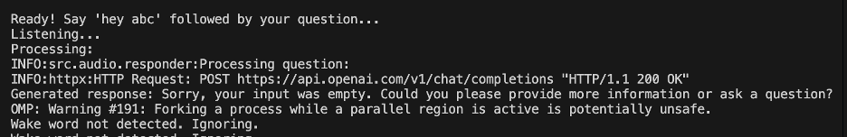
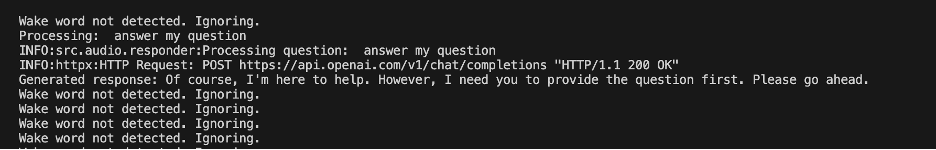

# AI-Voice-using-Google-TTS
Real-time Speech to Text to Speech : Building Your AI-Based Alexa - using Google's gTTS for Text-to-Speech


## Features
- **Voice Activation**: Customizable wake word (default: "hey oak")
- **GPT-4 Integration**: Advanced natural language processing
- **Whisper ASR**: Accurate speech-to-text conversion
- **Text-to-Speech**: Natural voice responses
- **Configurable Settings**: Adjust sensitivity, language, and more
- **Verbose Mode**: Detailed operation logging

## Quick Start

### Clone the Repository

```bash
git clone <repository-url>
```

### Install System Dependencies
For macOS:

```bash
brew install portaudio ffmpeg
```

### Set Up Python Environment
```bash
python -m venv venv
source venv/bin/activate
pip install -r requirements.txt
```

### Configure OpenAI API
Create a .env file in the project root:

```bash
API_KEY=your_openai_api_key_here
```

### Run the Assistant
```bash
python run.py
```

## Usage Examples
### Basic Usage
```bash
python run.py
```
Say "hey abc" followed by your question.

### High Accuracy Mode
```bash
python run.py --model medium --english --verbose
```

### Custom Wake Word
```bash
python run.py --wake_word "hello assistant"
```

### Noisy Environment
```bash
python run.py --energy 400 --dynamic_energy
```

## Troubleshooting

### Common Issues

#### No Microphone Input:
- Check microphone connections.
- Verify system permissions.
- Try increasing `--energy` value.

#### High CPU Usage:
- Use a smaller model (`--model tiny`).
- Increase pause threshold.
- Disable verbose mode.

#### API Errors:
- Verify API key in `.env`.
- Check internet connection.
- Ensure OpenAI account has credits.

## Sample Output

